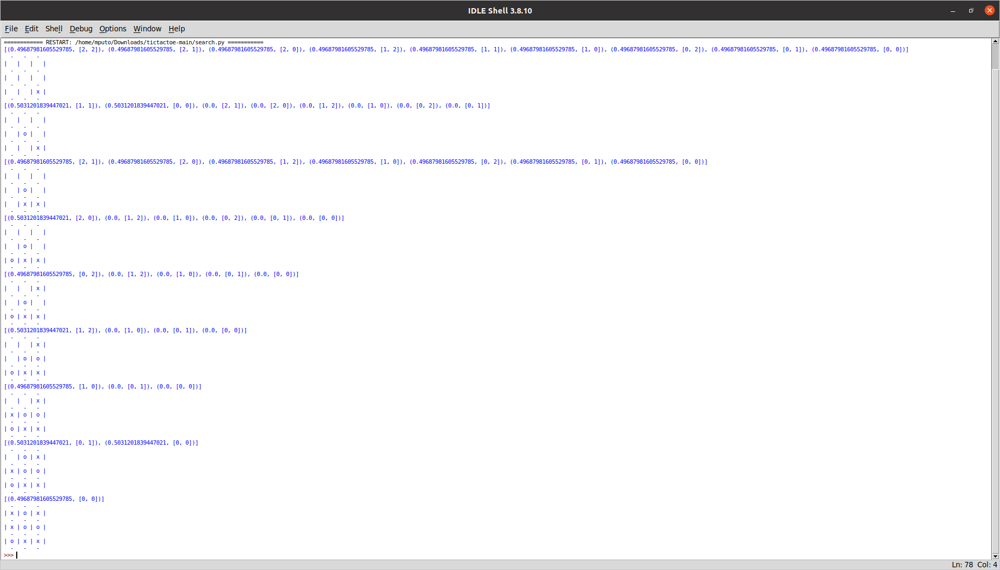

# tictactoe

Repository containing Tic-Tac-Toe AI. I provide the hand-written and neural network version of a player. You can also find here implementation of the tic-tac-toe game.

In game.py you can find basic board handling methods.\
The ttt_ai.py is perfect tic-tac-toe player according to game theory. \
nets.py contains neural net used in search.py.\
dataset.py is used to generate training points.\
The network training and testing is implemented in training.py file.\
search.py uses the network to search one ply deap. It also contains simple example showing how to use it.

